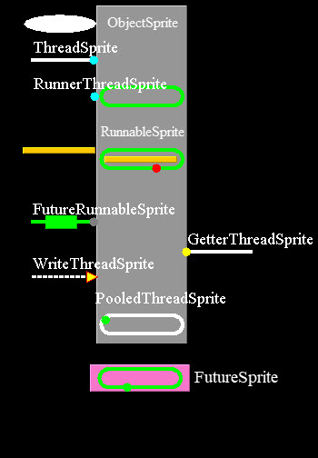

This is a the latest version of Java Concurrent Animated - 
(Original version binary download: https://sourceforge.net/projects/javaconcurrenta/)

In the original version too much control was taken by the canvas, and all of the interactions were dependent on the slide program.

In this reboot version, there is a single background thread per slide that carries all of the threads through the desired states. The renderer iterates through all of the threads, gets their state, current position, and shape, and renders them.

Many of the original animations have been enhanced to provide more control over the underlying threads, and CompletableFuture has been added.

Sprites List:

